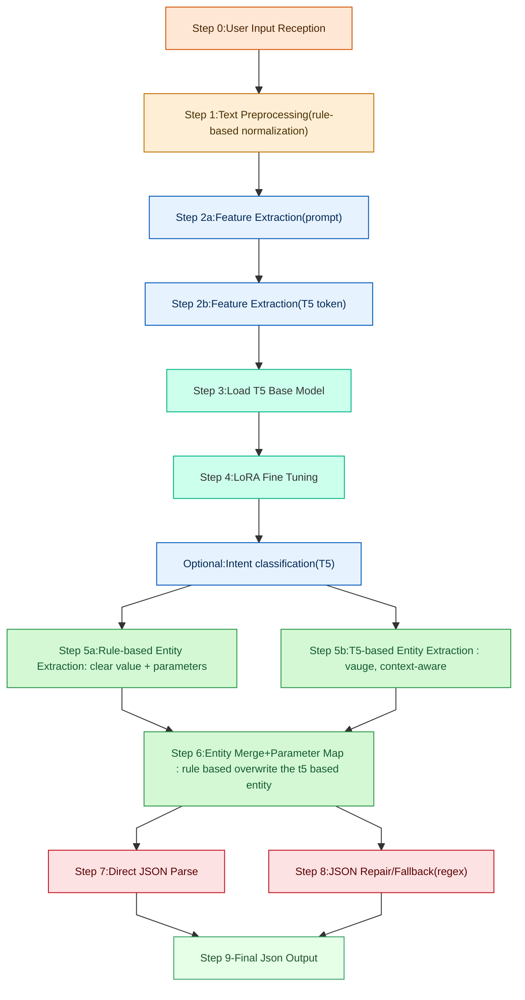

# Goal: Schema and Algorithm Logic for NLP Engine
## T5 based NLP Query Parser for Housing Query
This document describes the schema and algorithmic workflow for an NLP engine designed to parse housing-related user queries. The model combines a T5 transformer with rule-based logic to extract structured parameters from natural-language input.
The output format is JSON, enabling downstream systems (recommedener system) to consume standardized housing search parameters (for example: priority, location, budget, room count, rental/sale type, and other constraints).
## Flowchart

## Algorithmic Overview

1. User enters free-text housing request
2. T5 model generates candidate structured fields
3. Rule-based engine checks validity and normalizes values
4. JSON document returned to calling application

## Schema Design
 {
  "input_text": "I’d like a quiet flat in Lichtenberg, around 70 m2, safe area, near U-Bahn and swimming pool.",
  "slots": [
    {
      "priority": 1,
      "parameter": "surface_m2",
      "value": 70,
      "operator": ">="
    },
    
    {
      "priority": 2,
      "parameter": "district_id",
      "value": "lichtenberg",
      "operator": "=="
    },
    {
      "priority": 2,
      "parameter": "public_transport_distance",
      "value": 0.9,
      "operator": ">="
    },
    {
      "priority": 2,
      "parameter": "pool_distance",
      "value": 0.9,
      "operator": ">="
    },
    {
      "priority": 1,
      "parameter": "surface_area",
      "value": 70,
      "operator": ">="
    }
  

## Input and Output of each step

### step 0: User Input Reception
**Input:** Raw user query as free text

**Output:** Raw text string for preprocessing

**Preprcessing:** Accept from API or from User Input

### step 1: Text Preprocessing
**Input:** Raw text string

**Output:** Cleaned and normalized text

**Preprcessing:** lowercase, normalize special symobol($) or extra space

### step2a : Feature Extraction (Prompt Template Construction)
**Input:** Cleaned and normalized text

**Output:** structured prompt combined with instruction + target format

**Preprcessing:**
(1)Construct a prompt for T5 in the format
(2)Include ther user query in the instruction

### step 2b:Feature Extraction (T5 Tokenization & Label Mapping)- 
This is a more expressive and context-aware form of vectorization compared to 
classical NLP feature engineering.

**Input:** structured prompt combined with instruction + target format

**Output:** Tokenized input and label mappings ready for model inference

**Preprcessing:** 
(1)Tokenizer input using T5 tokenizer.
(2)Map labels
(3)Prepare attentation mask and input IDs for T5 model

### step 3: Load T5 Base Model
**Input:** Model configure and pretrained model(T5 small)

**Output:** T5 model object

**Preprcessing:** Load T5 small into the memory

### step 4:LoRA Fine Tuned
**Input:** T5 model object

**Output:** Fine tuning T5 ready for inference

**Preprcessing:** Fine tunibng using LoRA(Low Rank Adaption) for domain-specific knowledge

### step optional: Intent Classfication (House, Apartment, Shared room)
**Input:** tokenized input or cleaned text

**Output:** intent label: House

**Preprcessing:** Using T5 (or SBRET) to determine user intent(e.g renting an apartment)

### Step 5a: Rule-based Entity Extraction
**Input:** tokenized and fine-tuned T5 from step 2b and step 4

**Output:** Dictionary of clear entities

**Preprcessing:** extract clear entities

{"District": "Mitte", "price": "1200 EUR", "bedrooms": 2, "surface":80 }

### Step 5b: T5-based Entity Extraction 
**Input:** Tokenized prompt and fine-tuned T5 from step 2b and step 4

**Output:** Dictionary of extracted entities with possible uncernity or context-dependent values

**Preprcessing:** extract unclear or vauge entities or context dependent values

{ "give me the apartment, not too expensive", "afforable for Belin", "somewhere nearby city center", "quiet negiborhood" }

## Step 6: Entity Merge and Parameter Mapping
**Input:** Rule-based enetities from step 5a and T5 based entities from step 5b

**Output:** Merged and normalized entity dictionary

**Preprcessing:** Merged both sets of entities, rule-based extraction takes precedence

## Step 7: Direct JSON Parse
**Input:** Merged entity dictionary from step 6.

**Output:** Initial JSON document representing structured housing query

**Preprcessing:** Initial JSON document representing structured housing query

## Step 8: JSON Repair/Fallback
**Input:** Initial JSON from step 7.

**Output:** Corrected JSON ready for downstream.

**Preprcessing:** 
(1) Fix missing field using defaults
(2) Cleanup malformed entities using regex
(3) Validate field type (integer for bedrooms, string for location)

## Step 9: Final JSON Output
**Input:** Correct JSON from step 8.

**Output:** Final, structured JSON for housing query

**Preprcessing:** 
None

## Reason for Choosing T5 
T5 (Text-to-Text Transfer Transformer) is selected as the core model because it treats every NLP task as text-in, text-out, which aligns perfectly with our goal of converting natural housing queries into structured JSON parameters.

✅**Unified text-to-text paradigm**
We don’t need separate models for:
classification (intent)

entity extraction

normalization

response formatting

T5 handles them all as a single generative task.

✅**Perfect for structured output**
T5 has strong performance in tasks that require:

schema-bounded responses

structured text like JSON

long-form reasoning over inputs

This makes it easier to ensure the output fits our housing search JSON template.

✅**Context-aware understanding**
Housing queries often include nuance:

"somewhere near the city center"

"affordable but modern"

"2 beds or maybe 3 if in suburbs"

✅**Efficient fine-tuning (LoRA-friendly)**
We can customize T5 on a domain-specific housing dataset using LoRA adapters, which means:

No full retraining

Low compute cost

Fast iteration cycles

✅**Robust multilingual capability**
T5-base and multilingual variants help cover housing markets and user populations across languages 
(e.g., English + German, CN→EN future extension).

# 🎯  **Bottom Line** 
| Challenge                    | Solution in your design      |
| ---------------------------- | ---------------------------- |
| Generates imperfect JSON     | JSON repair step             |
| Hallucination risk           | Rule-based priority override |
| Weak on numeric precision    | Value-normalization rules    |
| Cost vs classical extraction | Hybrid design: rules + T5    |
| Domain knowledge required    | Dataset & prompt engineering |
