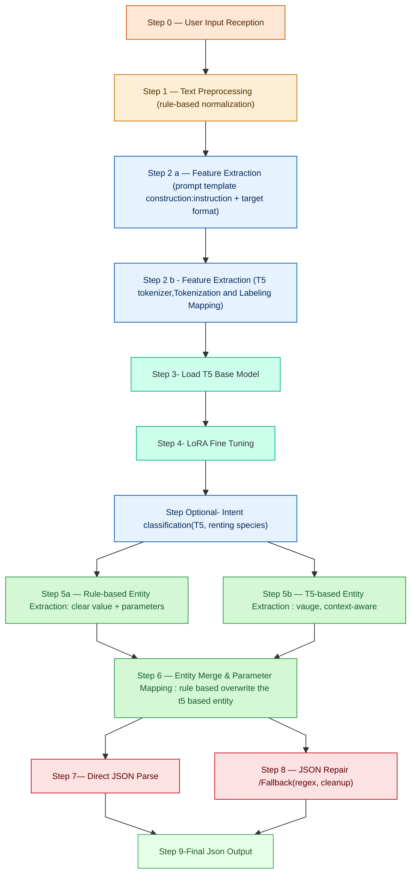

# Goal: Schema and Algorithm Logic for NLP Engine
## T5 based NLP Query Parser for Housing Query
This document describes the schema and algorithmic workflow for an NLP engine designed to parse housing-related user queries. The model combines a T5 transformer with rule-based logic to extract structured parameters from natural-language input.
The output format is JSON, enabling downstream systems (recommedener system) to consume standardized housing search parameters (for example: priority, location, budget, room count, rental/sale type, and other constraints).
## Flowchart

## Algorithmic Overview
